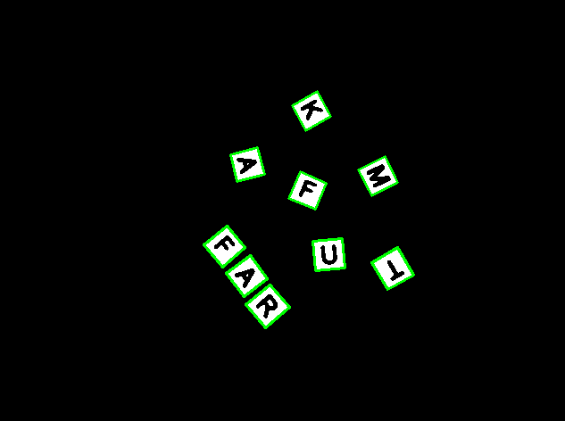
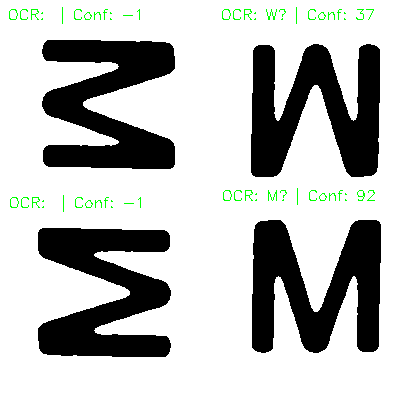
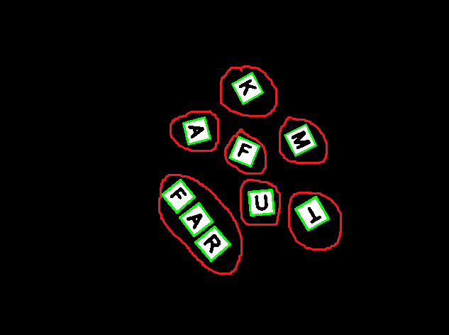
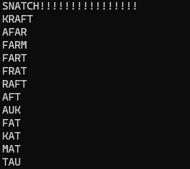

# snatchbot 🤖
See. Solve. Snatch. A real-time computer vision system that recognizes letter tiles and suggests the best possible moves on the fly.

**Note: The demo GIF may take a few seconds to load. Please be patient.**


## Features ✨
- 🎥 **Real-time Tile Recognition** – Uses contour detection to instantly identify letter tiles.
- 🧠 **AI-Powered Letter Recognition** – Extracts characters from detected tiles with OCR technology.
- ⚡ **Smart Word Suggestions** – Finds playable words with graph-based algorithms and updates them dynamically as new tiles appear.

## Rules of Snatch 📜
There are many variations of "snatch" (sometimes known as [Anagrams](https://en.wikipedia.org/wiki/Anagrams_(game))), but the version we play at home is as follows:
1. **Tile Pool Setup**: All tiles are placed face down in a pool at the center of the table. Players take turns flipping over tiles.
2. **Word Formation**: When a player spots a word of three or more letters, they can form it in two ways:
   - **Using face-up tiles** from the pool to create a valid word.
   - **Stealing words** by combining one or more face-up tiles from the pool with a player's existing word. For example, combining the word **CART** with a **K** from the pool to form **TRACK**. Players can also extend their own words with tiles from the pool.
3. **Calling "Snatch!"**: As soon as a player spots a word, they **call "snatch" immediately** and place the word in front of them. The game continues with players flipping additional tiles.
4. **Minimum Word Length**: All words must be at **least three letters long**.
5. **Game End & Scoring**: The game ends when all tiles are face up and no further words can be formed. Players score based on the number of letter tiles they have.

## How It Works ⚙️
The system uses **contour detection** to identify letter tiles, followed by **OCR** for character recognition. Once the tiles are detected, a **graph-based algorithm** forms connected words, and a **brute-force solver** finds the best possible words to play.

1. **Contour detection**: The raw frame from the camera is converted to grayscale, blurred and thresholded. Contour detection can then be used to pick out individual letter tiles; only tiles with a valid aspect ratio are selected.

2. **OCR**: Tesseract is the OCR engine used to extract letters from the tiles. Initially, I thought this would be simple; "just give it to some pre-trained neural network, easy peasy, job done." In reality, the main work involved "massaging" the image into similar images that the network has been trained on. Optimistically, I first tried to use a lightweight solution utilizing OpenCV's own [TextDetectionModel and TextRecognitionModel](https://docs.opencv.org/4.x/d4/d43/tutorial_dnn_text_spotting.html). However, since the training set was vastly different from the use case here, the results were not accurate enough. Tesseract was not straightforward either, as it is designed to recognize text from scanned documents in an upright orientation, rather than rotated letter tiles (see [this article](https://pyimagesearch.com/2021/11/15/tesseract-page-segmentation-modes-psms-explained-how-to-improve-your-ocr-accuracy/) for more information). For adapting to this unique use case, I used single-letter mode in Tesseract, rotated each tile, and selected the orientation with the highest probability. <br>

3. **Graph algorithm**: To produce words from the recognized letters, a graph is created where each node represents a letter tile. By defining adjacency based on the bounding boxes of the tiles, the graph connects adjacent letters. Using a depth-first search algorithm, the graph is traversed to identify connected components, each representing a word. This approach allows for forming words from individual letter tiles based on their spatial arrangement. <br>

4. **Brute-force solver**: A brute-force solver identifies potential snatchable words from the recognized letters. This involves generating all possible combinations of the words on the board, filtering out invalid combinations, and checking each valid combination against a dictionary of anagrams. The solver ensures that only words formed from multiple other words on the board are considered, and the final list of snatchable words is ordered by length and alphabetically. <br>


## Quick Start 🚀
1. Clone the repository:
   ```bash
   git clone https://github.com/aav31/snatchbot.git
   cd snatchbot
   ```
2. Clone the `vcpkg` repository and create the `vcpkg.exe`:
   ```bash
   git clone https://github.com/microsoft/vcpkg.git
   vcpkg\bootstrap-vcpkg.bat
   ```
3. Run the CMake step (specifying whichever generator or build system you have on your machine):
   ```bash
   cmake -B build -S . -G "Visual Studio 17 2022" -A x64
   ```
   Alternatively, if using Visual Studio with the `cmake` tools extension, you can just open the root folder in Visual Studio. `CMakeSettings.json` tells Visual Studio which build system you want to use, which configurations etc.
4. Build the project:
   ```bash
   cmake --build build --config Debug
   ```
5. Run the project:
   ```bash
   cd build\Debug
   my-project
   ```

## License 📄
This project is licensed under the MIT License. See the [LICENSE](LICENSE) file for more details.


## Tests ✅
Run all tests with:
```bash
cd build\Debug
my-project_tests
```
